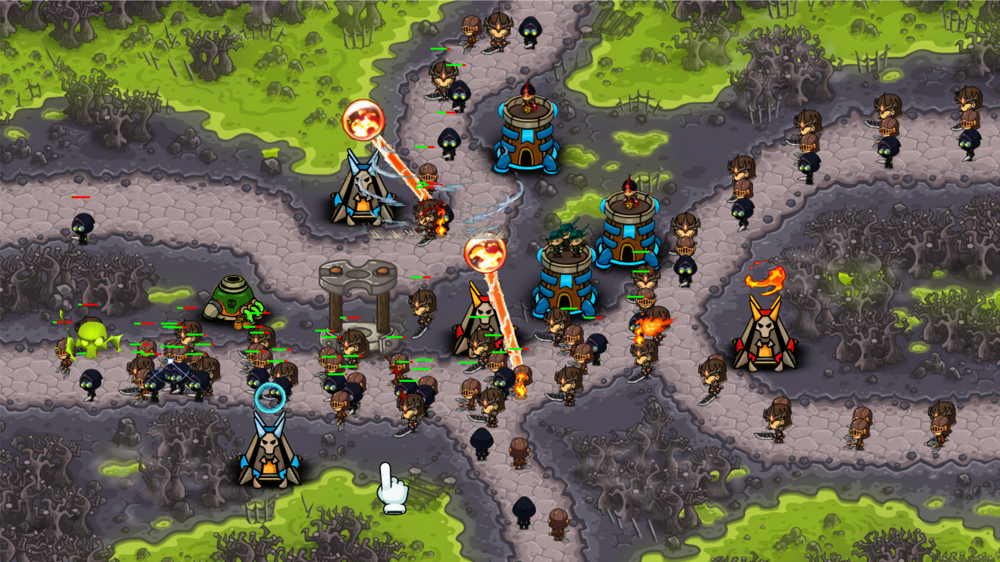

# Kingdom-Hush

  

  A Python-based tower defense game built from scratch using Pygame.

  
  
  

## About the Project

**Kingdom-Hush** is an original tower-defense game developed during my third semester in 2023 as a personal challenge to expand my programming and game development abilities.

Inspired by strategy games such as **Kingdom Rush**, the project recreates the core tower-defense experience: building defensive structures, managing resources, and defending against waves of enemies. Unlike using a commercial game engine, the entire game was developed from scratch using **Python and Pygame**.

### Highlights

- 🎮 Built a complete playable tower-defense game from the ground up
- 🧩 Designed and implemented the overall game architecture and core systems
- ⚔️ Developed real-time combat systems, enemy behaviors, tower mechanics, and animations
- 🎨 Managed asset research, integration, and visual presentation
- 🖥️ Created the rendering pipeline, game loop, object management, and user interaction systems using Pygame
- 🛠️ Completed the full development cycle, including planning, implementation, debugging, testing, and refinement

### Technical Focus

The project provided hands-on experience with:

- Python-based game architecture
- Real-time event handling and game loops
- Object-oriented programming design
- Collision detection and interaction systems
- State management and gameplay mechanics
- Building complete software systems without relying on existing game engines

### Recognition

The project was recognized as one of the strongest submissions in the course and received the highest evaluation due to its technical scope, creativity, implementation quality, and overall execution.

Kingdom-Hush represents my early experience in designing interactive systems, solving complex programming challenges, and developing complete software projects from the ground up.

> [!NOTE]
> The GIFs below demonstrate the mechanics of each tower.  
> Please wait a few seconds for them to fully load.

<h2 align="center">Tower Demos</h2>

<table>

<tr>

<td width="60%" align="center">

</td>

<td width="40%">

### Archer Tower

A fast defensive tower focused on single-target damage.

**Implemented systems:**
- Target detection and enemy tracking
- Attack range calculation
- Projectile creation and movement
- Damage handling and enemy interaction
- Multiple enemies attack handling

</td>

</tr>

<tr>

<td width="60%" align="center">

</td>

<td width="40%">

### Mortar Tower

A heavy defensive structure designed for area damage.

**Implemented systems:**
- Projectile trajectory and timing
- Splash damage mechanics
- Area-of-effect collision detection
- Multiple enemy interaction
- Combat state management

</td>

</tr>

<tr>

<td width="60%" align="center">

</td>

<td width="40%">

### Wizard Tower

A magic-based tower featuring special effects and unique attacks.

**Implemented systems:**
- Custom attack behavior
- Visual effects integration
- Enemy targeting logic
- Animation handling
- Ability-specific mechanics

</td>

</tr>

<tr>

<td width="60%" align="center">

</td>

<td width="40%">

### Flectro Tower

A specialized tower using both electrical and fire attacks to control groups of enemies.

**Implemented systems:**
- Chain-based attack behavior
- Dynamic target selection
- Effect timing and visual feedback
- Fire and Electrical attack based on level

</td>

</tr>

<tr>

<td width="60%" align="center">

</td>

<td width="40%">

### Smasher Tower

A powerful close-range defensive unit designed for heavy impact attacks.

**Implemented systems:**
- Melee attack mechanics
- Enemy proximity detection
- Impact-based damage calculation
- Attack animation synchronization
- Enemy freeze briefly

</td>

</tr>

<tr>

<td width="60%" align="center">

</td>

<td width="40%">

### Inferno Tower

An advanced defensive structure focused on sustained high damage output that increases over time.

**Implemented systems:**
- Continuous damage mechanics
- Attack progression logic
- Beam/effect rendering
- Target persistence system
- Advanced combat behavior handling

</td>

</tr>

</table>
