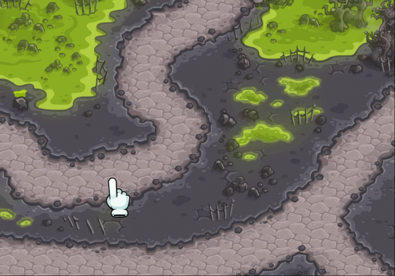

## About the Project

**Kingdom-Hush** is an independent tower-defense game project developed during my third semester in 2023 as a personal challenge to expand my programming and game development skills.

Inspired by tower-defense games such as **Kingdom Rush**, the project focuses on strategic defense mechanics where players build and manage defensive structures, defend against waves of enemies, and interact with different gameplay systems. Unlike using a commercial engine, the entire game was developed from scratch using **Python and Pygame**, including the game loop, rendering system, object management, animations, combat logic, and user interactions.

The project was designed and built entirely by me, including gameplay programming, system design, asset research and integration, and overall project development. The goal was to push my abilities beyond standard coursework by creating a complete playable experience while developing a deeper understanding of game architecture and software design.

Over approximately three months of development, I worked through the full game development pipeline, from initial concept and implementation to refinement and testing. This included designing gameplay mechanics, implementing real-time systems, managing game states, and solving the technical challenges involved in building a complete game framework without relying on existing engines.

This project was recognized as one of the strongest submissions in the course, receiving the highest evaluation due to its technical scope, implementation quality, creativity, and level of independent work.

Kingdom-Hush represents my early experience in designing interactive systems, solving complex programming challenges, and building complete software projects independently from the ground up.

<h2 align="center">Demos</h2>

<table>
<tr>
<td align="center">

 
<b>Archer Tower</b>
</td>

<td align="center">

 
<b>Mortar </b>
</td>

<td align="center">

 
<b>Wizard Tower</b>
</td>
</tr>

<tr>
<td align="center">

 
<b>Demo 4</b>
</td>

<td align="center">

 
<b>Demo 5</b>
</td>

<td align="center">

 
<b>Demo 6</b>
</td>
</tr>
</table>
